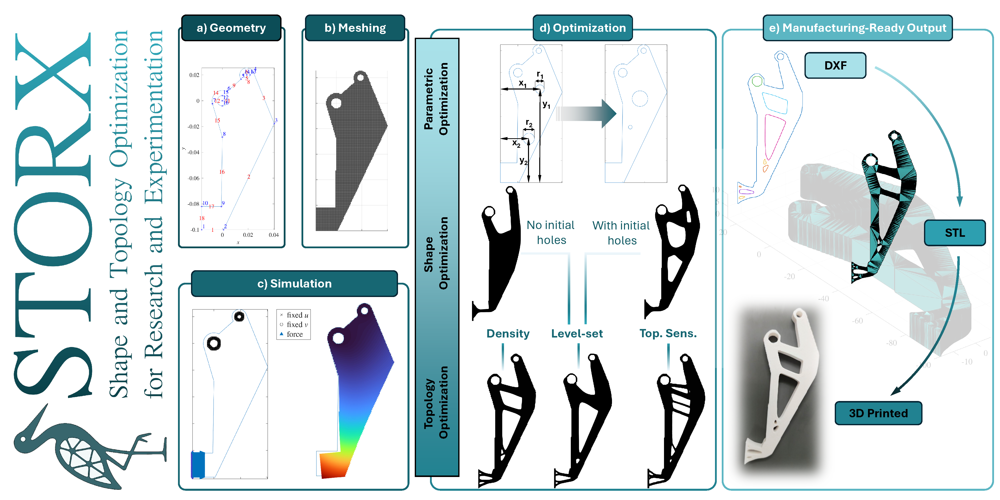
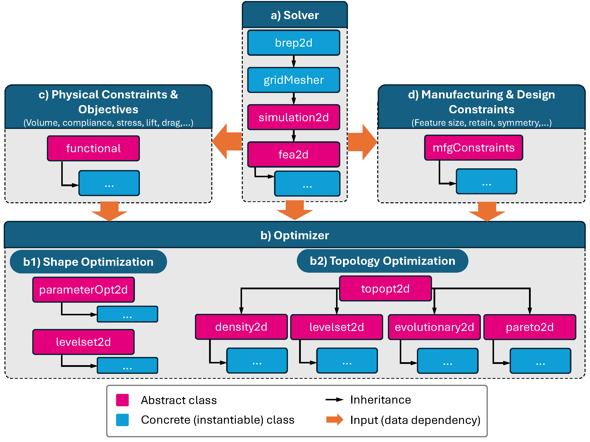

[](https://github.com/DEL-KU/storx/actions/workflows/matlab_tests.yml)
[](LICENSE.md)


<h1 align="center">
  
</h1>


## Overview

<p align="center">

</p>

**STORX** (Shape and Topology Optimization for Research and Experimentation) contains the core functionalities for shape optimization (SO) and topology optimization (TO) methods implemented in **MATLAB** using an **object-oriented programming (OOP)** approach.

To the best of our knowledge, STORX is the **first open-source MATLAB framework to unify parametric shape, level-set shape, and multiple families of topology optimization** (density-based, level-set, and topological-sensitivity-driven, including evolutionary and Pareto-tracing strategies) within a single consistent architecture. By implementing all of these methods on top of shared solver, sensitivity, and manufacturing-constraint interfaces, STORX makes the **similarities and differences** between SO/TO methods explicit, where students and researchers can see which parts of the design-optimization pipeline (state solve, functional evaluation, sensitivity analysis, regularization, constrained update) are shared across methods and which are method-specific, and can compare methods under identical physical and numerical conditions.

It is intended to be used as the accompanying code for the:

1) Mirzendehdel, Amir M., and Krishnan Suresh. "STORX: An Open-Source Object-Oriented Framework for Shape and Topology Optimization in MATLAB." arXiv preprint arXiv:2606.17291 (2026).

---

The figure below illustrates the overarching design optimization process, highlighting the three main approaches covered: size optimization, shape optimization (both parametric and level-set based), and topology optimization. These categories help students understand where different algorithms fit into the overall design optimization landscape and how they relate to one another. 
<p align="center">

</p>


The main focus of this code is on TO. The animation below provides a more detailed breakdown of the TO techniques included in the code. It depicts density-based methods like SIMP and RAMP, level-set methods using both standard and modified Hamilton–Jacobi formulations, and evolutionary techniques such as ESO and Pareto-based optimization. Example equations and representative results shown under each category give a quick overview of the underlying mathematical formulations and typical structural layouts these methods produce.

<p align="center">

</p>

The primary goals of this implementation are:
- To help students understand underlying concepts easily.
- To produce **readable**, **well-structured** code.
- To make the software **easy to extend** for future learning or research.
- To balance **readability and computational efficiency**.

Each module emphasizes:
- Clear class hierarchies
- Defined application programming interfaces (APIs)
- Maintainable dependencies
- Ease of explanation in educational contexts
---

## Organization and Structure

<p align="center">

</p>

The class diagram above summarizes the four major components of STORX and how they connect:

- **(a) Solver**: the geometry is defined as a boundary representation (`brep2d`), discretized by a structured mesher (`gridMesher`), and passed to a physics solver derived from the abstract `simulation2d`/`fea2d` interfaces. The instantiated FEA object is the central data structure of the framework: it is passed as an input to every other module.
- **(b) Optimizer**: design-update algorithms take a solver object as input. Shape optimizers (`parameterOpt2d`, level-set) and topology optimizers (`topopt2d` with `density2d`, `levelset2d`, `evolutionary2d`, and `pareto2d` subclasses) all share the same structure, which is what makes side-by-side comparison of methods possible.
- **(c) Physical constraints and objectives**: quantities of interest (volume, compliance, stress, lift, drag, ...) are classes derived from the abstract `functional` base class; each evaluates its response and its gradient with respect to the active design variables.
- **(d) Manufacturing and design constraints**: operators derived from the abstract `mfgConstraints` base class (feature size, retain, symmetry, ...) act on the design variables and sensitivity fields to promote manufacturable solutions.

In the diagram, magenta boxes are abstract classes, blue boxes are concrete (instantiable) classes, black arrows denote inheritance, and orange arrows denote data dependency (inputs). Because the core software contracts are defined by the abstract base classes, new physics, objectives, constraints, and optimization strategies are added by writing derived classes without modifying the core code. The modules below follow this architecture, and the numbered directories mirror the order in which the material is taught.

### 1. Boundary Representation in 2D
**File:** `01-brep2d/brep2d.m`  
**Description:**  
Classes for creating and manipulating 2D geometries using boundary representations.  
**Examples:** 
See `01-brep2d/brepexamples` for example geometry `.brep` files.
See `00-examples/Chapter2-Representations/examples_brep2d.m` for examples on how to create `brep2d` objects.

---

### 2. Grid Meshing
**File:** `02-mesher2d/gridMesher.m`  
**Description:**  
Methods for generating computational meshes for finite element analysis and optimization algorithms.
**Examples:** 
See `00-examples/Chapter2-Representations/examples_gridMesher2d.m` for examples on how to create `gridMesher` objects.

---

### 3. Finite Element Analysis (FEA)
**Directory:** `03-fea2d/`  
**Description:**  
FEA solvers built on top of a common abstract class structure:
- `simulation2d.m`: Abstract class defining generic physics simulation APIs.
- `fea2d.m`: Abstract class defining FEA-specific methods.

Implemented FEA solvers:
- `fea2d_elasticity.m`
- `fea2d_thermal.m`
- `fea2d_thermoelasticity.m`
- `fea2d_fluid.m`

**Examples:** 
See `00-examples/Chapter3-FEA/*` for examples on how to create `fea2d` objects.

---

### 4. Parametric Shape Optimization
**Directory:** `04-parameterOpt2d/`  
**Description:**  
Implements optimization by directly adjusting geometric parameters and analyzing the FEA response.

**Examples:** 
See `00-examples/Chapter4-ParametricOpt/*` for examples on how to create `parameterOpt2d` objects.

---

### 5. Shape and Topology Optimization
**Directory:** `05-topopt2d/`  
**Description:**  
Implementations of shape and topology optimization methods:
- Density-based methods
- Level-set methods
- Evolutionary methods
- Pareto-tracing methods

Common APIs and abstract classes for SO/TO algorithms can be found in the `05-topopt2d` directory.

**Examples:** 
See `00-examples/Chapter6-LevelsetShapeOpt/*` onward for examples on how to create `topoptOpt2d` objects.

---

### 6. Objectives and Constraints
**Directory:** `06-optFunctional/`  
**Description:**  
Objective and constraint functionals (e.g., volume, compliance) implemented as classes derived from the abstract base class `functional.m`. New objectives and constraints only need to implement two methods — one to evaluate the response and one to compute its sensitivity — and can be used with any of the SO/TO methods without modifying the core code. A `template.m` is provided as a starting point.

---

### 7. Manufacturing and Design Constraints
**Directory:** `07-mfgConstraints/`  
**Description:**  
Manufacturing and design constraints (minimum feature size, physical density projection, retained regions, symmetry) implemented as modular operators derived from the abstract base class `mfgConstraints.m`. Each constraint acts on the design and sensitivity fields through `filterDesign` and `filterSensitivity`, and plugs into any optimizer without changes to the physics solver or optimization algorithm.

---

## Requirements

- **MATLAB** R2019b or later (the codebase uses `arguments` validation blocks). Developed and tested with MATLAB R2025a.
- **Optimization Toolbox** (required) — `fmincon` is used throughout the parametric shape optimization (`04-parameterOpt2d/`) and truss (`extras/trussFEA/`) solvers.
- **Global Optimization Toolbox** (optional) — only needed for the multi-start and global-search examples (`04-parameterOpt2d/parameterOpt2d_MS.m`, `parameterOpt2d_GS.m`), which use `MultiStart` and `GlobalSearch`.
- **Partial Differential Equation Toolbox** (required) — `01-brep2d/brep2d.m` builds geometry with `createpde`/`geometryFromEdges` and plots with `pdegplot`; `03-fea2d/fea2d_elasticity.m` also calls `pdegplot`.
- **Image Processing Toolbox** (required for topology optimization) — `bwconncomp`, `imdilate`, and `strel` are used in the level-set (`05-topopt2d/levelset2d/`), evolutionary/Pareto (`05-topopt2d/topologicalSensitivity2d/`), and retain-constraint (`07-mfgConstraints/retain/`) classes. Not needed for FEA-only or parametric shape optimization workflows.
- A small set of third-party utilities (level-set reinitialization, figure export, colormaps) are provided under `utilities/thirdParty/` with their own licenses, so no separate download is needed.

---

## Getting Started

1. Clone the repository:
   ```bash
   https://github.com/DEL-KU/storx.git
2. Open MATLAB and navigate to the desired directory.
3. Run `runMeFirst.m` file to initialize.
3. Run one of the example scripts.
4. Modify existing classes or add new classes as needed.

---

## Educational Value

This software was designed for educational use:

- Clear and commented code.
- Abstract class hierarchies that illustrate the architecture.
- Straightforward to explain and extend.
- Vectorized implementations of key routines for efficiency, with optional explicit nested-loop versions for pedagogical transparency.
- A chapter-organized example sequence (`00-examples/`) that mirrors how the material is taught progressively in a course.

Unlike existing educational codes, which are typically built around a single formulation ("script-per-method"), STORX is, to the best of our knowledge, the first open-source MATLAB framework to unify parametric shape, level-set shape, and multiple families of topology optimization. Implementing all of these methods under a common class architecture makes their similarities and differences explicit rather than hidden inside separate, unrelated scripts: formulation-specific codes obscure the pipeline that all SO/TO methods share (state solve, functional evaluation, sensitivity analysis, regularization, constrained update), whereas STORX exposes it directly and lets students explore the continuum between shape and topology optimization in a transparent, reproducible workflow.

STORX has been used as the primary computational framework in a graduate-level course on shape and topology optimization at the University of Kansas, where students implemented and compared methods following the chapter sequence, incorporated newly introduced concepts (e.g., local volume fraction constraints) as homework, and extended the framework in independent projects spanning antenna shape optimization, fluid–structure interaction for wing design, and topology optimization of auxetic metamaterials.

Although teaching is the primary focus, the implementation is practical enough for small- to medium-scale optimization problems. Educators interested in adopting STORX are welcome to reach out for accompanying teaching materials (syllabi, lecture modules, and assignments).

---

## Citation

If you use STORX in your research, please consider citing it.

```bibtex
@article{mirzendehdel2026storx,
  title={STORX: An Open-Source Object-Oriented Framework for Shape and Topology Optimization in MATLAB},
  author={Mirzendehdel, Amir M and Suresh, Krishnan},
  journal={arXiv preprint arXiv:2606.17291},
  year={2026}
}
```
---

## License

This repository is released under the MIT License.
See [LICENSE.md](LICENSE.md) for further details.

---

## Contact

For questions, contributions, or suggestions, please contact amirzend@ku.edu.
