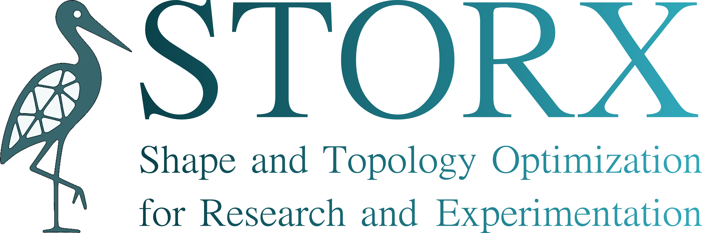
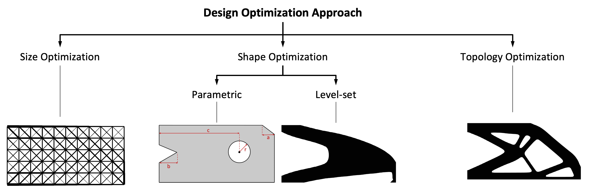
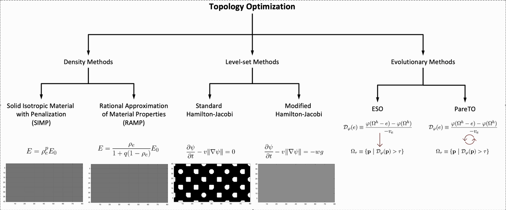

[](https://github.com/DEL-KU/storx/actions/workflows/matlab_tests.yml)
[](LICENSE)


<h1 align="center">
  
</h1>


## Overview

This repository contains the core functionalities for shape optimization (SO) and topology optimization (TO) methods implemented in **MATLAB** using an **object-oriented programming (OOP)** approach.
It is intended to be used as the accompanying code for the:

1) Mirzendehdel, Amir M., and Krishnan Suresh. "STORX: An Open-Source Object-Oriented Framework for Shape and Topology Optimization in MATLAB." arXiv preprint arXiv:2606.17291 (2026).

---

The figure below illustrates the overarching design optimization process, highlighting the three main approaches covered: size optimization, shape optimization (both parametric and level-set based), and topology optimization. These categories help students understand where different algorithms fit into the overall design optimization landscape and how they relate to one another. STORX focuses on shape and topology optimization and does not cover size optimization.
<p align="center">

</p>

The main focus of this code is on TO. The animation below provides a more detailed breakdown of the TO techniques included in the code. It depicts density-based methods like SIMP and RAMP, level-set methods using both standard and modified Hamilton–Jacobi formulations, and evolutionary techniques such as ESO and Pareto-based optimization. Example equations and representative results shown under each category give a quick overview of the underlying mathematical formulations and typical structural layouts these methods produce.

<p align="center">

</p>

The primary goals of this implementation are:
- To help students understand underlying concepts easily.
- To produce **readable**, **well-structured** code.
- To make the software **easy to extend** for future learning or research.
- To balance **readability and computational efficiency**.

Each module emphasizes:
- Clear class hierarchies
- Defined application programming interfaces (APIs)
- Maintainable dependencies
- Ease of explanation in educational contexts
---

## Organization and Structure

### 1. Boundary Representation in 2D
**File:** `01-brep2d/brep2d.m`  
**Description:**  
Classes for creating and manipulating 2D geometries using boundary representations.  
**Examples:** 
See `01-brep2d/brepexamples` for example geometry `.brep` files.
See `00-examples/Chapter2-Representations/examples_brep2d.m` for examples on how to create `brep2d` objects.

---

### 2. Grid Meshing
**File:** `02-mesher2d/gridMesher.m`  
**Description:**  
Methods for generating computational meshes for finite element analysis and optimization algorithms.
**Examples:** 
See `00-examples/Chapter2-Representations/examples_gridMesher2d.m` for examples on how to create `gridMesher` objects.

---

### 3. Finite Element Analysis (FEA)
**Directory:** `03-fea2d/`  
**Description:**  
FEA solvers built on top of a common abstract class structure:
- `simulation2d.m`: Abstract class defining generic physics simulation APIs.
- `fea2d.m`: Abstract class defining FEA-specific methods.

Implemented FEA solvers:
- `fea2d_elasticity.m`
- `fea2d_thermal.m`
- `fea2d_thermoelasticity.m`
- `fea2d_fluid.m`

**Examples:** 
See `00-examples/Chapter3-FEA/*` for examples on how to create `fea2d` objects.

---

### 4. Parametric Shape Optimization
**Directory:** `04-parameterOpt2d/`  
**Description:**  
Implements optimization by directly adjusting geometric parameters and analyzing the FEA response.

**Examples:** 
See `00-examples/Chapter4-ParametricOpt/*` for examples on how to create `parameterOpt2d` objects.

---

### 5. Shape and Topology Optimization
**Directory:** `05-topopt2d/`  
**Description:**  
Implementations of shape and topology optimization methods:
- Density-based methods
- Level-set methods
- Evolutionary methods
- Pareto-tracing methods

Common APIs and abstract classes for SO/TO algorithms can be found in the `05-topopt2d` directory.

**Examples:** 
See `00-examples/Chapter6-LevelsetShapeOpt/*` onward for examples on how to create `topoptOpt2d` objects.

---

## Getting Started

1. Clone the repository:
   ```bash
   https://github.com/DEL-KU/storx.git
2. Open MATLAB and navigate to the desired directory.
3. Run `runMeFirst.m` file to initialize.
3. Run one of the example scripts.
4. Modify existing classes or add new classes as needed.

---

## Educational Value

This software was designed for educational use:

- Clear and commented code.
- Abstract class hierarchies that illustrate the architecture.
- Straightforward to explain and extend.

Although teaching is the primary focus, the implementation is practical enough for small- to medium-scale optimization problems.

---

## Citation

If you use STORX in your research, please consider citing it.

```bibtex
@article{mirzendehdel2026storx,
  title={STORX: An Open-Source Object-Oriented Framework for Shape and Topology Optimization in MATLAB},
  author={Mirzendehdel, Amir M and Suresh, Krishnan},
  journal={arXiv preprint arXiv:2606.17291},
  year={2026}
}
```
---

## License

This repository is intended for educational purposes.  
See the `LICENSE` file for further details.

---

## Contact

For questions, contributions, or suggestions, please contact amirzend@ku.edu.
